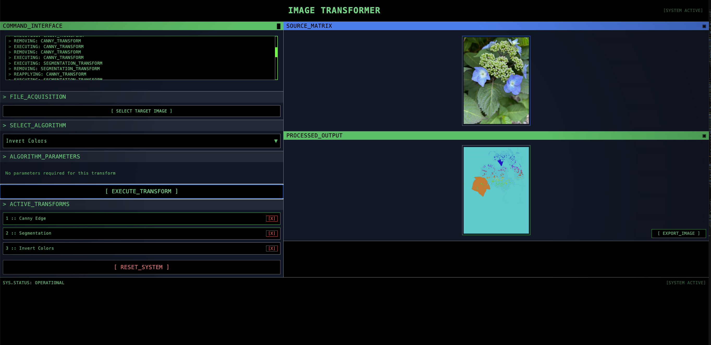

# Image Transformer



**Live Demo: [https://semajyllek.github.io/image-transformer](https://semajyllek.github.io/image-transformer)**

A cyberpunk-themed web application for applying various image transformations.


## Features

- Multiple image transformations:
  - Grayscale conversion
  - Edge detection (Sobel)
  - Canny edge detection
  - Image segmentation
  - Threshold filter
  - Contrast adjustment
  - Brightness control
  - Sharpening
  - Color inversion
  - Color transparency
- Visual cyberpunk/terminal interface
- Save transformed images
- Chain multiple transformations

## Tech Stack

- React
- Tailwind CSS
- HTML Canvas API

## Development

### Prerequisites

- Node.js (v14 or higher)
- npm or yarn

### Setup

1. Clone the repository:
   ```bash
   git clone https://github.com/semajyllek/image-transformer.git
   cd image-transformer
   ```

2. Install dependencies:
   ```bash
   npm install
   ```

3. Start the development server:
   ```bash
   npm start
   ```
   This will run the app in development mode. Open [http://localhost:3000](http://localhost:3000) to view it in your browser.

### Project Structure

```
image-transformer/
├── public/           # Static files
├── src/              
│   ├── utils/        # Utility functions
│   │   ├── colorUtils.js            # Color conversion utilities
│   │   └── transformationFunctions.js # Image transformation algorithms
│   ├── App.js        # Main application component
│   ├── index.js      # Application entry point
│   └── index.css     # Global styles
├── .github/          # GitHub configuration
│   └── workflows/    # GitHub Actions workflows
└── package.json      # Project dependencies
```

### Building for Production

```bash
npm run build
```

This will create a production-ready build in the `build` folder.

## Deployment

The application is automatically deployed to GitHub Pages whenever changes are pushed to the main branch.

To manually deploy:

```bash
npm run deploy
```

## How to Use

1. **Upload an Image**: Click the "SELECT TARGET IMAGE" button to upload an image.
2. **Select Algorithm**: Choose a transformation algorithm from the dropdown menu.
3. **Adjust Parameters**: Modify the parameters for the selected algorithm using the sliders.
4. **Apply Transform**: Click the "EXECUTE_TRANSFORM" button to apply the transformation.
5. **Chain Transforms**: Apply multiple transformations in sequence by repeating steps 2-4.
6. **Save Result**: Click the "EXPORT_IMAGE" button to save the processed image.

## License

[MIT License](LICENSE)

## Contributing

Contributions are welcome! Please feel free to submit a Pull Request.